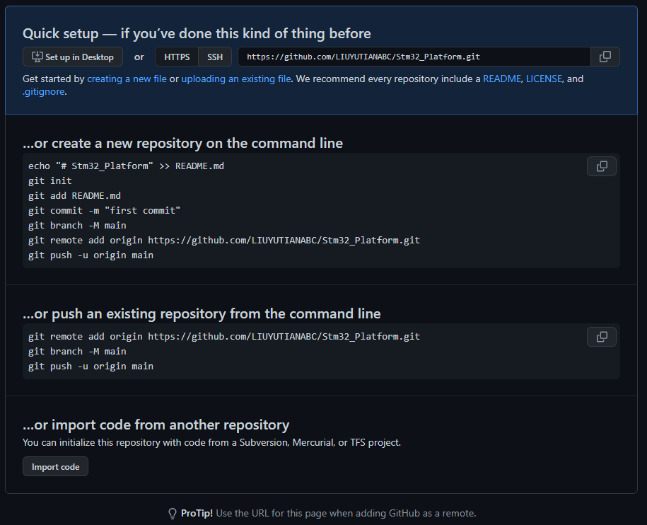

### Git Command

#### 原网址

以下内容来源于互联网，欢迎查看原网址：
在此鸣谢：
- https://www.liaoxuefeng.com/wiki/896043488029600

#### User

- git config --global user.name "LiuYutian"
- git config --global user.email "1428456495@qq.com"

- git config user.name
- git config user.password
- git config user.email

- git config --list                 查看配置的一些参数

#### Command

- mkdir learngit                    创建路径
- cd learngit                       切换目录
- cd ..                             回到上一层目录
- pwd                               显示当前目录
- ls -ah                            查看隐藏文件
- ls -a                             查看隐藏文件
- ls                                查看文件

- git init                          创建仓库
- rm -rf .git                       删除 Git 仓库
- git add file2.txt file3.txt       添加文件到仓库
- git commit -m "add 3 files."      提交文件保存
- git status                        获得当前 git 的状态
- git diff file_name                查看修改内容

- git log                           查看提交的日志文件
- git log --pretty=oneline          显示简略信息

- git reset --hard HEAD^            恢复成上一个版本
- git reset --hard HEAD^^           恢复成上上一个版本
- git reset --hard HEAD~100         恢复成上上 100 个版本
- git reset --hard abeccf4          恢复成 “abeccf4” 的版本
- cat readme.txt                    可以在 git Bash 查看文件内同
- git reflog                        查看每一次提交的 massage 和 SHA1 内容

- git restore file_name             没有使用 add 把文件添加到仓库，可以恢复文件
- git restore --staged file_name    使用 add 把文件添加到仓库，可以推出添加但保留文件变更

- git rm file_name                  删除文件
- git restore file_name             恢复文件
- git restore --staged file_name    恢复 add 后的文件

创建 GitHub 账户：
user: 1428456495@qq.com
pass: Yutian641010Liu

- ssh-keygen -t rsa -C "youremail@example.com"         创建SSH Key
- .SSH 在用户主目录: C:\Users\LiuYutian\.ssh
- Git支持SSH协议
- 把每台电脑的SSH Key都添加到GitHub，就可以在每台电脑上往GitHub推送 push 了,否则无法 push
- 在 GitHub 上免费托管的Git仓库，任何人都可以看到，但是不能改

GitHub 创建存储库（Repository）：learngit
- 关联本地仓库和 GitHub 仓库，
  - 使用 https 协议关联: git remote add origin http://github.com/LIUYUTIANABC/learngit.git
  - 使用SSH协议关联: git remote add origin git@github.com:LIUYUTIANABC/learngit.git
- 远程库的名字：origin（默认）

- 把本地库所有内容推送到远程库： git push -u origin master
- 注意： 第一次提交远程库，需要 git 授权给 GitHub 之后提交就没有了
- 第一次提交用 '-u' 的作用是把本地 master 和远程的 master 关联起来，以后推送或者拉取是可以简化命令
- 简化的命令： git push origin master

- git remote                查看远程库
- git remote -v             查看远程库信息
- git remote rm origin      删除远程库，实际上是解除本地和远程的绑定关系
  - GitHub 上的远程库本身并没有任何改动，要真正删除需要登录Github页面删除按钮删除
  - origin 是远程库的名字，origin是习惯命名

- 从零开发，最好的方式是先创建远程库，然后再克隆
- git clone git@github.com:LIUYUTIANABC/gitskills.git    使用SSH 协议和 GitHub 通信
  - git clone https://github.com/LIUYUTIANABC/gitskills.git    使用https 协议和 GitHub 通信

##### 分支管理————重点

git 支持多分支， 功能强大， 速度快， 实际上就是相当于多添加了一个指针

创建与合并分支

- git checkout -b dev             创建 dev 分支，然后切换到 dev 分支
  - git checkout 的 '-b' 参数表示创建并切换
  - git branch dev                单独创建分支
  - git checkout dev              单独切换到 dev 分支
  - git switch -c dev             创建分支并切换的另一种写法
  - git switch master             单独切换分支的令一种写法
- git branch                      查看当前所有的分支
- git merge drv                   把 dev 分支合并到 master
  - 提示信息 Fast-forward          表示是快速模式，直接改变 master 指针，不会检查冲突
- git branch -d dev               删除分支

解决冲突

- git switch -c feature1          创建分支
- git add -- git commit           提交修改
- git switch master               切换回主分支
- git add -- git commit           提交冲突的修改
- git merge feature1              合并出现冲突，手动解决，保存文件
- git add -- git commit           再次提交修改后的文件
- 这样就把其他分支，合并到了主分支，但其他分支的内容依旧不变
- git log --graph                 查看分支合并情况，详细信息
- git log --graph --pretty=oneline --abbrev-commit        查看分支合并，缩略版的，含主要信息
- git branch -d feature1          删除 feature1 分支
- 因为主干合并后，分支的内容依旧没有改变，如果以后再开发，需要重新生成分支
- 这个分支内容已经不和主干一致了

分支策略管理

Git 用 Fast forward 模式，删除分支后，会丢掉分支信息
禁用 Fast forward 模式，使用普通模式合并
普通模式：git 会在 merge 时生成一个新的 commit 这样就会保存分支历史，看得到分支信息

- git merge --no-ff -m "merge with no-ff" dev        禁用 Fast forward， 可以看到分支信息

> 分支管理：
> 首先，master分支应该是非常稳定的，也就是仅用来发布新版本，平时不能在上面干活；
> 那在哪干活呢？干活都在dev分支上，也就是说，dev分支是不稳定的，到某个时候，
> 比如1.0版本发布时，再把dev分支合并到master上，在master分支发布1.0版本；

Bug 分支

在工作用正在添加一些功能，有个需要优先处理的 Bug, 可以使用 stash 来存储现在的工作区，恢复之前状态，等修改完 Bug 合并之后，再恢复现在的工作区。

- 前提：在现在的分支（dev）中有添加或修改文件，已经 add，但没有commit
- git stash             保存当前的工作区
- 回到 master 分支，创建 Bug 分支，修改 Bug， 正常提交之后，merge 到主分支，完成修改，删除 Bug 分支 issue-101
- 回到之前的 dev 分支，git switch dev
- git stash list        查看保存的工作区
- git stash apply stash@{0}       恢复之前的工作区，但是stash 内容还在
- git stash drop stash@{0}        删除 stash 工作区
- git stash pop         恢复的同时删除

怎么把 master 分支中，修改的 Bug 也添加到现在的 dev分支中

- 手动修改，再一次提交，可以完成
- 使用 cherry-pick 命令复制一个特定的提交
  - 在 dev 分支中使用
  - git cherry-pick 2e846d5          复制在 master 修改 bug 后的代码
  - 注意： 这里的 commit 是 master 提交的那个 SHA 值， 不是 merge 的那个 SHA 值

Feature 分支

- 真正的开发项目中，每添加一个新功能，最好重新建一个 feature 分支，完成后，合并，再删除 feature 分支
- git switch -c feature-vulcan            创建一个分支
- 修改，添加，提交，回到 dev 分支合并
- git branch -d feature-vulcan            删除分支失败，因为还没有合并
- git branch -D feature-vulcan            强制删除

多人协作

在自己的电脑创建 master 和 dev 分支，通过 push 推送到 GitHub 然后，另外一台电脑（需要添加SSH Key）或者另一个目录通过 clone 命令，克隆远程库

- 另一台电脑：
  - 此时，他的目录下只能看到 master 分支，看不到 dev 分支
  - git checkout -b dev origin/dev            创建远程 origin 的 dev 分支到本地
  - 此时，git branch 查看分支，就有 dev 分支了，就可以在 dev 分支上进行修改，提交
  - 通过 git push origin dev                  推送 dev 分支的修改
- 我的电脑，做了修改后：
  - git push origin dev    试图推送，但是失败，因为，远程的版本库有更新版本
  - 此时用 git pull                            把远程库的最新内容拉区下来
    - 如果可以拉取，说明本地 dev 和远程 origin/dev 是有连接的
    - 如果拉取失败，使用    git branch --set-upstream-to=origin/dev dev     链接本地 dev 分支和远程 origin/dev 分支
  - 合并冲突，git push origin dev           推送我的修改
- git fetch origin master           从远程获取最新的版本到本地，不会自动merge
- git log -p master..origin/master  查看本地 master 分支和远程库的 master的区别
- git merge origin/master           合并 origin/master 到本地 master
- git pull                          相当于git fetch 加 git merge

Rebase 的使用

在多人协作的时候，后push的人不得不先pull，再merge，再 push，这样就产生了时间的交叉。
情景：自己修改了代码做了两次提交，在push的时候，出错，需要先 pull

- git log --graph --pretty=oneline --abbrev-commit          查看提交日志
- 当你 pull 之后，本地 git 会自动生成一个新的 commit，位于你做的两次提交之后，此时，你会发现有问题，因为，这个 pull 明明应该是我两次提交之前的操作才对
- 使用 git rebase               把 pull 的 commit 放到你做的修改之前
- 这样你的提交历史，是按照时间先后成一条直线
- push 到远程库，再看 log 你会发现之前 pull 的那个 commit 放在了你自己commit之后，你的修改才是远程看最新的修改

##### 标签管理——————存放软件发布版本

创建标签（tag）一般是在 master 分支上执行

- git tag v1.0              默认在最新提交的 commit 上创建标签
- git tag                   查看所有创建的标签
- git log --pretty=oneline --abbrev-commit          查看所有提交日志的主要信息，包含 tag 指针，master head 指针等
- git tag v0.9 6e6eac6      在之前 commit 上打标签，id（SHA1 码）= 6e6eac6
- git show v0.9             查看标签详细信息
- git tag -a v0.1 -m "version 0.1 released" d6cfcc7         创建带有说明的标签
- 注意：标签指向的是 commit 的id，所以，如果分支中存在打标签的 commit 就可以查看到标签

- git tag -d v0.1           删除本地标签
- git push origin v1.0      推送标签 v0.1 到远程
- git push origin --tags    推送全部本地标签到远程
- 删除远程标签
  - git tag -d v0.9           先删除本地 v0.9 标签
  - git push origin :refs/tags/v0.9     删除远程的 v0.9 标签
  - 登录 GitHub 查看标签是否删除

##### 如何 pull request

在别人的 GitHub 上 Fork 一个开源库，这样在自己 GitHub上就有了一个一样的 origin；

- git clone git@github.com:michaelliao/bootstrap.git                克隆远程上的开源库
- git remote add upstream https://github.com/michaelliao/lerngit.git            添加你 fork的别人的库
- git remote -v                 查看远程库连接 origin是自己的库，upstream 是别人的库
- 创建分支，提交修改，push 到自己的库
- 在自己的 GitHub 上操作，自己 repo 上，点击 pull request，点击 new pull request
- comparing changes 判断差异，提交 pull request

##### 使用 Gitee 管理开源项目

Gitee 是国内 OSChina 创建的类似 GitHub的开源托管网站，速度快；

- 注册账号，添加 SSH KEY 公钥
- 创建项目，最好和本地库保持一致
- git remote add origin git@gitee.com:LIUYUTIANABC/learngit.git             把本地库和gitee的远程库关联
- 如果之前关联过 GitHub 那么会提示关联库已经存在
- git remote -v                     查看远程库信息
- git remote rm origin              删除已有的远程库
- 再次关联 gitee 使用 git remote add origin git@gitee.com:LIUYUTIANABC/learngit.git

- 关联远程库 gitee 之后要推送本地库到远程，出现问题，提示需要 先建立关联，在 pull
- git branch --set-upstream-to=origin/master master             建立分支关联
- git pull；（git push; git merge） 提示 fatal: refusing to merge unrelated histories 需要允许合并不相关的历史记录
  - git pull origin master --allow-unrelated-histories  允许合并不相关的历史记录, 就可以了
  - git push origin master --allow-unrelated-histories
  - git merge origin master --allow-unrelated-histories

- 同时关联 Gitee 和 GitHub
- 删除现有的远程库 git remote rm origin
- git remote add gitee git@gitee.com:LIUYUTIANABC/learngit.git
- git remote add github git@github.com:LIUYUTIANABC/learngit.git
- git remote -v              查看远程库会发现有两个
- 远程库的名字，分别是 gitee 和 github 以后要推送的时候应该使用这两个名字

- Gitee 的 pull requests 和 GitHub 的操作一样
- 先 Fork，再 clone，再添加修改，再push 到远程库，再在自己的远程库 pull request

##### 自定义 Git

- git config --global color.ui true         让 Git 显示颜色，文件夹等会有颜色
- git config --global color.ui false         取消 Git 显示颜色

忽略特殊文件

.gitignore 常用的配置文件： https://github.com/github/gitignore

- 忽略文件原则
  - 自动生成文件，编译产生的中间文件
  - 带有敏感信息的配置文件，比如口令

在根目录创建 .gitginore 文件，里面填入要忽略的文件名，提交到 git 就可以了；
判读有没有忽略使用 git status 查看 working directory clean

- git add app.class                     忽略了 *.class；又需要添加会提示不能添加
- git add -f app.class                  强制添加该文件到 git
- git check-ignore -v app.class         查看 .gitignore 中哪里出了规则错误

在 .gitignore 中指定文件不能忽略用
- !app.class          不排除文件 app.class

配置别名

- git config --global alias.st status           使用 st 代替 status；使用方法 git st
- git config --global alias.co checkout         使用方法 git co
- git config --global alias.ci commit           使用方法 git ci
- git config --global alias.br branch           使用方法 git br
- git config --global alias.unstage 'reset HEAD'           使用方法 git unstage test.py
- git config --global alias.last 'log -1'       最后一次提交日志；git last
- git config --global alias.lg "log --color --graph --pretty=format:'%Cred%Greset -%C(yellow)%d%Creset %s %Cgreen(%cr) %C(bold blue)<%an>%Creset' --abbrev-commit"         使用 git lg 输出日志格式很好看

> - 如果一个参数没有空格，就可以不用引号，比如
> - git commit -m update
> - 如果一个参数有空格，就必须加引号：
> - git commit -m "update README.txt"
> - 如果参数有双引号就用单引号：
> - git commit -m 'update "README.txt"'
> - 如果参数有单引号就用双引号：
> - git commit -m "update 'README.txt'"
> - 单引号和双引号还有一些细微区别，可以去看bash手册。

查看配置的别名

使用 --global 表示全局变量：配置文件在用户主目录下的 .gitconfig中
- cat .gitconfig

不使用 --global 表示只在当前仓库有效：配置文件都放在.git/config文件中
- cat .git/config

删除别名：直接在配置文章的 [alias] 下删除别名行就行

##### 搭建 Git 服务器

- https://www.liaoxuefeng.com/wiki/896043488029600/899998870925664

##### 使用 SourceTree

- 官方网站： https://www.sourcetreeapp.com/
- 参考文档： https://www.liaoxuefeng.com/wiki/896043488029600/1317161920364578

#### Note

- git add 后面增加的文件用空格分开
- git commit 如果有文件被修改了，也需要使用 add 命令之后才能提交到仓库
- git reset 恢复上一个版本后，使用 git log 已经无法查看之前更新的版本了
  - 要使用 git reflog 查看所有提交的版本 SHA1 的值
- 要使用 git reset 必须提交版本库中所有修改的文件，否则恢复之后，修改内容丢失

- 工作区和暂存区： git add 把文件存储到暂存区;  git commit 把暂存区文件提交到 master 分支中
- git 管理的是修改：
  - 如果执行，第一次修改 -> git add -> 第二次修改 -> git commit
  - 使用 git status 查看发现，第二次修改不会提交
  - 正确方法： 第一次修改 -> git add -> 第二次修改 -> git add -> git commit

- 删除文件：
  - 使用 git rm 删除文件；恢复使用 git restore；确实删除使用 git commit
  - 先手动删除文件，然后使用git rm <file>和git add<file>效果是一样的。

### Linux Command

- git  用的是 Linux 的命令， 所以  git bash 可以使用  Linux  命令

- mkdir learngit            创建路径
- touch file_name           创建一个新的文件
- code file_name            使用 code 打开
- rm -f file_name           删除文件
- rm -rf files_name         删除文件夹
- clear                     清空窗口

### Windows Command

- mkdir wikihow             创建路径
- cd wikihow                切换目录
- dir                       查看路径内容
- cls                       清空窗口
- NUL> aa                   创建新文件
- del aa                    删除文件
- cd..                      回到上一层目录
- rmdir name                删除空白目录
- rmdir /s wikihow          删除目录和文件

### Github 加速

#### 参考网址

- 知乎： https://zhuanlan.zhihu.com/p/75994966
        https://zhuanlan.zhihu.com/p/403089781

- GitHub520： https://gitee.com/inChoong/GitHub520
- https://www.cnblogs.com/qujingtongxiao/p/13041623.html

- 1、获取GitHub官方CDN地址

> - 查看 IP 地址：https://ipaddress.com/
>
> - GitHub.com    IP地址：140.82.113.4
> - assets-cdn.github.com    IP地址：185.199.111.153
> - github.global.ssl.fastly.net    IP地址：199.232.69.194

```
140.82.113.3    github.com
185.199.108.153 assets-cdn.github.com
199.232.69.194  github.global.ssl.fastly.net
```

```
# GitHub Start
140.82.112.3 github.com
140.82.114.4 gist.github.com
185.199.108.153 assets-cdn.github.com
199.232.68.133 raw.githubusercontent.com
199.232.68.133 gist.githubusercontent.com
199.232.68.133 cloud.githubusercontent.com
199.232.68.133 camo.githubusercontent.com
199.232.68.133 avatars0.githubusercontent.com
199.232.68.133 avatars1.githubusercontent.com
199.232.68.133 avatars2.githubusercontent.com
199.232.68.133 avatars3.githubusercontent.com
199.232.68.133 avatars4.githubusercontent.com
199.232.68.133 avatars5.githubusercontent.com
199.232.68.133 avatars6.githubusercontent.com
199.232.68.133 avatars7.githubusercontent.com
199.232.68.133 avatars8.githubusercontent.com
# Github End
```

- 2、修改系统Hosts文件

> - 接着,打开系统hosts文件(需管理员权限)。
> - 路径：C:\Windows\System32\drivers\etc\hosts
> - 使用 code 打开编辑会提示使用管理员权限
> - 并在末尾添加三行记录并保存。(需管理员权限，注意IP地址与域名间需留有空格)

- 3、刷新系统DNS缓存

> - 最后,Windows+X 打开系统命令行（管理员身份）或powershell
> - 运行 ipconfig /flushdns 手动刷新系统DNS缓存。

### 新建一个开发项目

- 从零开始，先在 GitHub 上创建一个新的存储库
- 在本地对应位置创建文件夹，进行 git 初始化和连接存储库
- echo "# Stm32_Platform" >> README.md          echo 命令相当于 printf; 这里的命令是把 "..." 输出到后面的 README.md 文件当中
  - touch LICENSE .gitignore                      创建文件

- git 默认不会 add 空文件，在空文夹中创建 .gitkeep 文件，就可以 add 了
  - .gitkeep 没有意义，就是一个占位符
  - git add 文件夹名     就可以直接添加文件夹和子文件
- git commit          进行提交
- git branch -M main    是修改现在的分支名称（由 master 改为 main）也可以再改回来
- git remote add github git@github.com:LIUYUTIANABC/Stm32_Platform.git          添加远程库
- git push -u github master           可以把工程文件推送到刚创建的存储库中


